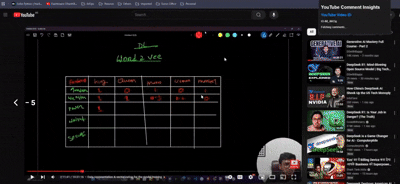

# 🎥 YouTube Sentiment Insights

**End-to-End MLOps Project for YouTube Comment Sentiment Analysis using a Chrome Extension, DVC, MLflow, AWS, and LightGBM**

YouTube Sentiment Insights is an **end-to-end Machine Learning + MLOps project** that analyzes the sentiment of YouTube video comments and presents the results through a simple dashboard-like experience.

The project combines a **traditional NLP/ML pipeline** with **MLOps best practices** such as **DVC for pipeline orchestration**, **MLflow for experiment tracking and model registry**, **AWS for remote artifact storage and deployment**, and a **Chrome extension frontend** that interacts with the sentiment analysis API.

---

## 🎥 Demo



---

## 📌 Table of Contents

- [Why This Project Exists](#-why-this-project-exists)
- [Project Overview](#-project-overview)
- [Features](#-features)
- [ML Workflow](#-ml-workflow)
- [MLOps Workflow](#-mlops-workflow)
- [Tech Stack](#-tech-stack)
- [Project Structure](#-project-structure)
- [How It Works](#-how-it-works)
- [Setup Instructions](#-setup-instructions)
- [Future Improvements](#-future-improvements)
- [Acknowledgement](#-acknowledgement)
- [Contact](#-contact)

---

## ❓ Why This Project Exists

YouTube comments contain a huge amount of user feedback, opinions, reactions, and sentiment. For creators, marketers, researchers, and even casual viewers, manually reading thousands of comments to understand the overall tone of a video is time-consuming and impractical.

### Problems
- Videos often receive **hundreds or thousands of comments**
- Manually identifying whether the audience reaction is **positive, negative, or neutral** is inefficient
- There is no simple way to get a **quick sentiment summary** of a video’s comment section
- Building an ML solution is only half the task — making it **reproducible, trackable, and deployable** is equally important

### ✅ Solution

This project solves the problem by building a system that:

- Detects/open a **YouTube video**
- Extracts or sends comments for analysis
- Classifies comments into:
  - **1 → Positive**
  - **0 → Neutral**
  - **-1 → Negative**
- Produces sentiment outputs that can be consumed by a **Chrome extension / frontend**
- Uses **DVC + MLflow + AWS + CI/CD** to make the entire workflow production-oriented and reproducible

---

## 📖 Project Overview

This project follows a **traditional Machine Learning NLP pipeline** rather than an LLM-based approach.

The core idea is to train a sentiment classifier on a labeled **Reddit sentiment dataset**, then use that model to predict sentiment on **YouTube comments** through a lightweight application flow.

### High-level workflow

1. **Collect sentiment dataset** for training
2. **Clean and preprocess text**
3. **Train a sentiment classification model**
4. **Track experiments with MLflow**
5. **Version the ML pipeline with DVC**
6. **Register the trained model**
7. **Expose model predictions through a Flask API**
8. **Use a Chrome extension frontend** to interact with the API for YouTube sentiment analysis
9. **Dockerize + prepare AWS deployment + CI/CD workflow**

---

## 🚀 Features

### 💬 YouTube Comment Sentiment Analysis
- Analyze comments from a YouTube video
- Predict sentiment for each comment
- Classify into:
  - Positive
  - Neutral
  - Negative

---

### 🧹 NLP Preprocessing Pipeline
- Missing value handling
- Duplicate removal
- Empty text filtering
- Lowercasing
- Stopword removal
- Lemmatization
- Text normalization

---

### 🧠 Traditional ML Model Training
- TF-IDF vectorization
- N-gram feature engineering
- LightGBM-based multi-class sentiment classifier
- Configurable hyperparameters using `params.yaml`

---

### 📊 Experiment Tracking with MLflow
- Log experiments and compare runs
- Track model performance
- Save artifacts remotely on AWS S3
- Register the final trained model in **MLflow Model Registry**

---

### 🔁 Reproducible DVC Pipeline
- Version-controlled ML pipeline
- Separate stages for:
  - Data ingestion
  - Data preprocessing
  - Model building
  - Model evaluation
- Easy reproducibility using DVC commands

---

### ☁️ AWS-based MLOps Setup
- MLflow tracking server hosted on **EC2**
- Artifacts stored in **S3**
- AWS CLI used to connect local development environment with AWS resources

---

### 🧩 Chrome Extension Frontend
- Chrome extension frontend for interacting with the sentiment analysis system
- Designed to work with YouTube and show sentiment insights to the user

---

### 🐳 Deployment Ready
- Dockerized application setup
- GitHub Actions CI/CD workflow included
- Ready for cloud deployment and automation

---

## 🛠 Tech Stack

| Layer | Technology |
|------|------------|
| Language | Python |
| ML / NLP | Scikit-learn, NLTK, LightGBM |
| Feature Engineering | TF-IDF Vectorizer |
| Experiment Tracking | MLflow |
| Pipeline Orchestration | DVC |
| Backend API | Flask |
| Frontend | Chrome Extension (HTML, CSS/JS, Manifest) |
| Cloud | AWS EC2, AWS S3, AWS CLI |
| CI/CD | GitHub Actions |
| Serialization | Pickle |
| Data Handling | Pandas, NumPy |
| Config Management | YAML |

---

## 📂 Project Structure

```text
Youtube-Sentiment-Insights/
│
├── .dvc/
├── .github/
│   └── workflows/
│       └── cicd.yaml
│
├── assets/
│   └── demo.gif
│
├── data/
│   └── ...
│
├── flask_app/
│   ├── app.py
│   └── test.py
│
├── notebooks/
│   └── ...
│
├── src/
│   ├── data/
│   │   ├── data_ingestion.py
│   │   └── data_preprocessing.py
│   │
│   └── model/
│       ├── model_building.py
│       ├── model_evaluation.py
│       ├── register_model.py
│       └── __init__.py
│
├── yt-chrome-plugin-frontend/
│   ├── manifest.json
│   ├── popup.html
│   └── popup.js
│
├── .dvcignore
├── .gitignore
├── confusion_matrix_Test Data.png
├── dvc.lock
├── dvc.yaml
├── experiment_info.json
├── lgbm_model.pkl
├── params.yaml
├── README.md
├── requirements.txt
├── setup.py
└── tfidf_vectorizer.pkl

---

## 🔄 How It Works

### 1. Train the Sentiment Model

The ML pipeline starts with the Reddit sentiment dataset.

- Ingest data  
- Clean and preprocess comments  
- Convert comments into TF-IDF features  
- Train a LightGBM sentiment classifier  
- Save the vectorizer and trained model  

---

### 2. Track Experiments with MLflow

During training and evaluation:

- Metrics can be logged  
- Artifacts can be stored  
- The best model can be registered for downstream use  

---

### 3. Serve the Model via Flask API

The Flask app loads:

- `tfidf_vectorizer.pkl`
- `lgbm_model.pkl`

Then it exposes prediction endpoints for inference.

---

### 4. Connect with Chrome Extension

The Chrome extension acts as the user-facing layer.

#### Typical flow:
- User opens a YouTube video  
- Extension UI is triggered  
- Comments are extracted / passed to backend  
- Flask API predicts sentiment  
- Results are shown back to the user  

---

## 🧪 Model Development Journey

During experimentation, the project followed a practical model improvement path.

### Baseline
- Random Forest baseline model  
- Around **64% accuracy** with **1000 features**

### Improvements Explored
- TF-IDF feature engineering  
- Trigram features  
- Tuning `max_features`  
- Handling class imbalance using **SMOTE**  
- Experimenting with stronger models such as:
  - XGBoost  
  - Decision Trees  
  - LightGBM  

### Final Direction
- Traditional NLP + TF-IDF pipeline  
- LightGBM classifier  
- MLOps pipeline for reproducibility and deployment  

---

## ⚡ Setup Instructions

### 🔧 Prerequisites

Make sure you have the following installed:

- Python 3.9+ (recommended)
- Git
- pip
- DVC
- Docker *(optional, for containerization)*
- AWS CLI *(if using remote MLflow / AWS setup)*
- Google Chrome *(for extension testing)*

---

### 📥 1. Clone the Repository

```bash
git clone https://github.com/Umer2900/Youtube-Sentiment-Insights.git
cd Youtube-Sentiment-Insights
```

### 📦 2. Create Virtual Environment

Windows

```Bash
python -m venv venv
venv\Scripts\activate
```

Mac/Linux

```Bash
python3 -m venv venv
source venv/bin/activate
```


### ▶️ 3. Install Dependencies
```bash
pip install -r requirements.txt
```

### ▶️ 4. Run the DVC Pipeline

If the DVC pipeline is configured and dependencies are available:

```bash
dvc repro
```

### ▶️ 5. Run the Flask API

From the project root, run:

```bash
python flask_app/app.py
```

The API will typically run locally at:
http://127.0.0.1:5000


### 🧩 6. Load the Chrome Extension

i. Open Chrome and go to:

```
chrome://extensions/
```

ii. Enable Developer mode

iii. Click Load unpacked

iv. Select the folder:

```
yt-chrome-plugin-frontend/
```

Now the extension can be tested in Chrome.

```bash
dvc repro
```


### ☁️ 7. AWS + MLflow Setup (Project Workflow)

If you want to replicate the MLOps setup used in this project, the general steps are:

**Create AWS resources**

- Create an IAM user
- Create an S3 bucket
- Launch an EC2 instance

**Configure AWS CLI**

Install and configure AWS CLI locally / on EC2:

```
aws configure
```

Add:

- AWS Access Key
- AWS Secret Key
- Region
- Output format

**Start MLflow Server**

Use the EC2 machine as the MLflow tracking server and S3 as artifact storage.

Note: Exact MLflow server commands may depend on your EC2 environment, bucket name, and tracking URI setup.

---

## 🙌 Acknowledgement

This project was built as an **end-to-end MLOps + NLP + Deployment project** covering:

- Traditional Machine Learning for NLP  
- Text preprocessing and feature engineering  
- Experiment tracking with MLflow  
- DVC pipeline creation  
- AWS integration  
- Flask API development  
- Chrome extension integration  
- CI/CD and deployment concepts  

It is designed as a hands-on project to demonstrate how a model moves from:

**data → training → tracking → serving → frontend integration → deployment**

---

## 📬 Contact

**Mohammad Umer Jan**  
B.Tech CSE | Data Science Enthusiast | MLOps & Machine Learning Learner  

- GitHub: [Umer2900](https://github.com/Umer2900)